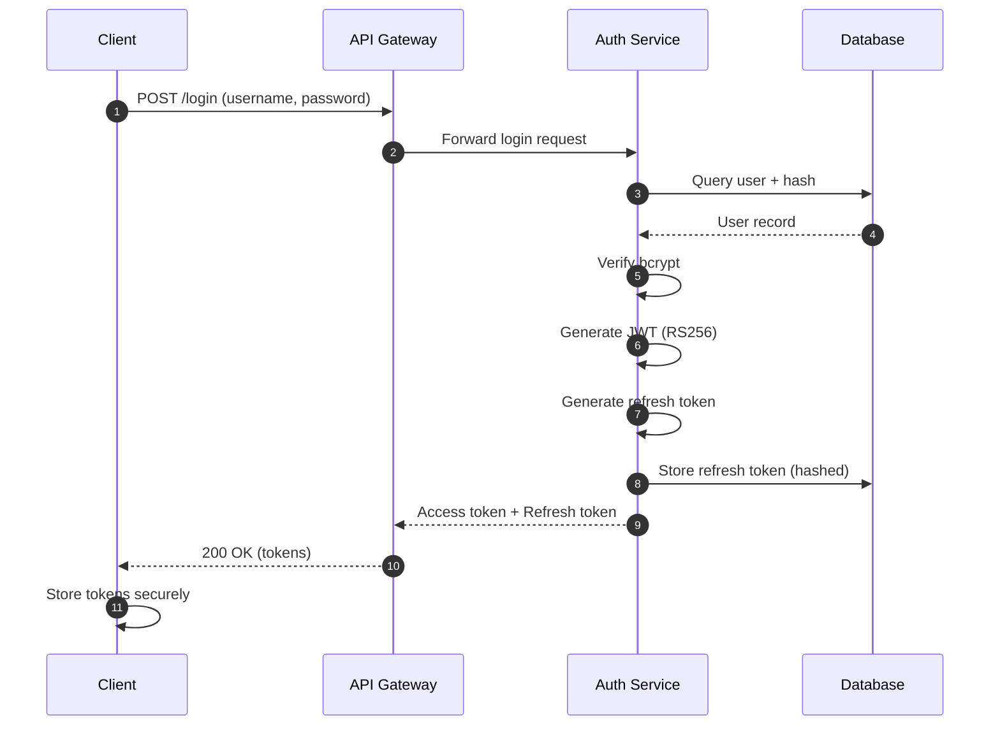
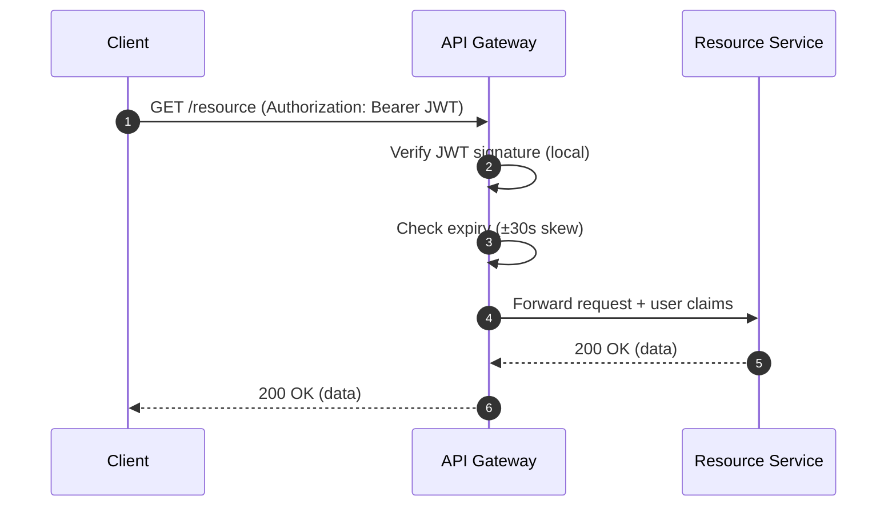
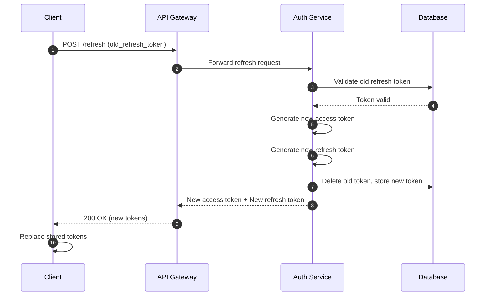

# Auth Service - Requirements (FROZEN)

**Date:** 2026-03-02
**Status:** FROZEN
**Version:** 1.0
**Reviewed:** Yes - See [critic-report-2026-03-02.md](../critic-report-2026-03-02.md)

---

## Overview

Authentication and authorization service providing token-based authentication for API Gateway and downstream services.

## Architecture Decisions (From Critic Review)

| Decision | Rationale |
|----------|-----------|
| **Access Token Validation:** Local at API Gateway | JWT is stateless; no need for inter-service call on every request |
| **Refresh Token Validation:** Auth Service with database | Stateful; enables revocation and abuse detection |
| **Access Token Expiry:** 15 minutes | Short window limits impact of token compromise |
| **Refresh Token Expiry:** 7 days | Balance between security and UX |
| **Token Rotation:** Yes | Every refresh issues new refresh token, old one invalidated |
| **Multi-Device:** Support up to 5 active refresh tokens per user | Modern UX expectation |

---

## Functional Requirements

### FR1: User Login

**Endpoint:** `POST /api/v1/auth/login`

**Request:**
```json
{
  "username": "string",
  "password": "string"
}
```

**Success Response (200 OK):**
```json
{
  "access_token": "string (JWT)",
  "refresh_token": "string",
  "token_type": "Bearer",
  "expires_in": 900
}
```

**Behavior:**
1. Validate user credentials against User Database
2. Verify password hash using bcrypt (work factor 12)
3. Generate JWT Access Token (15 min expiry)
4. Generate Refresh Token (7 day expiry)
5. Store refresh token in database (hashed)
6. Apply rate limiting: 5 attempts per IP per minute

**Error Responses:**
- `401`: Invalid credentials
- `429`: Too many attempts (rate limit)
- `500`: Internal server error

### FR2: Token Validation

**Implementation:** LOCAL at API Gateway (no Auth Service call)

**Behavior:**
1. Extract JWT from Authorization header
2. Verify signature using public key (RS256)
3. Check token expiry (with 30-second clock skew tolerance)
4. Extract user claims

**Performance Target:** < 10ms (local verification)

### FR3: Token Refresh

**Endpoint:** `POST /api/v1/auth/refresh`

**Request:**
```json
{
  "refresh_token": "string"
}
```

**Success Response (200 OK):**
```json
{
  "access_token": "string (JWT)",
  "refresh_token": "string (new token)",
  "token_type": "Bearer",
  "expires_in": 900
}
```

**Behavior:**
1. Validate refresh token against database
2. Check if token is revoked or expired
3. **Token Rotation:** Issue new refresh token, invalidate old one
4. Generate new access token
5. Delete old refresh token, store new one
6. Apply rate limiting: 10 refreshes per user per minute

**Error Responses:**
- `401`: Invalid or expired refresh token
- `429`: Too many refresh attempts

### FR4: User Logout

**Endpoint:** `POST /api/v1/auth/logout`

**Request:**
```json
{
  "refresh_token": "string"
}
```

**Success Response (200 OK):**
```json
{
  "message": "Logged out successfully"
}
```

**Behavior:**
1. Invalidate refresh token in database
2. Add access token JTI to blacklist (optional, for immediate revocation)
3. Return success

**Note:** Access tokens remain valid until expiry (15 min). For immediate revocation, use token blacklist.

### FR5: Password Reset (NEW)

**Endpoint:** `POST /api/v1/auth/password-reset/request`

**Request:**
```json
{
  "email": "string"
}
```

**Behavior:**
1. Generate reset token (UUID, 1 hour expiry)
2. Send email with reset link
3. Store reset token in database

**Endpoint:** `POST /api/v1/auth/password-reset/confirm`

**Request:**
```json
{
  "token": "string",
  "new_password": "string"
}
```

**Behavior:**
1. Validate reset token
2. Update password hash
3. Invalidate all existing refresh tokens for user
4. Delete reset token
5. Send confirmation email

### FR6: Account Deletion (NEW)

**Endpoint:** `DELETE /api/v1/auth/account`

**Auth:** Required

**Behavior:**
1. Invalidate all refresh tokens for user
2. Add all access token JTIs to blacklist
3. Mark account as deleted (soft delete)
4. Schedule hard delete after 30 days

---

## Non-Functional Requirements

### NFR1: Security

| Requirement | Specification |
|-------------|---------------|
| Password Hashing | bcrypt with work factor 12 |
| JWT Algorithm | RS256 (asymmetric) |
| Access Token Expiry | 15 minutes |
| Refresh Token Expiry | 7 days |
| Refresh Token Limit | 5 active tokens per user |
| TLS | Required for all endpoints |
| Rate Limiting | Login: 5/IP/min, Refresh: 10/user/min |
| Clock Skew Tolerance | ±30 seconds |
| Secret Storage | Environment variables or secret manager |

### NFR2: Performance

| Operation | Target | Notes |
|-----------|--------|-------|
| Login | < 500ms | Includes database query |
| Token Validation | < 10ms | Local JWT verification |
| Token Refresh | < 200ms | Database query required |
| Logout | < 100ms | Database update |

### NFR3: Availability & Degradation

| Scenario | Behavior |
|----------|----------|
| Normal Operation | Full functionality |
| Database Unavailable | Read-only mode: existing tokens valid, no new logins |
| Auth Service Down | API Gateway uses cached public keys, rejects new logins |
| Network Partition | API Gateway continues with local validation |

**Degradation Mode Definition:**
- **Read-Only:** Token validation continues (local JWT), login/refresh/return 503
- **Grace Period:** 30-second clock skew tolerance for expiry validation

### NFR4: Scalability

| Aspect | Approach |
|--------|----------|
| Token Validation | Stateless JWT, local at gateway |
| Auth Service | Horizontal scaling, stateless |
| Database | Connection pooling, read replicas |
| Target Capacity | 1000 req/s (load tested) |

### NFR5: Monitoring & Observability

| Metric | Target |
|--------|--------|
| Login Success Rate | > 99% |
| Token Validation Latency | p95 < 15ms |
| Database Connection Pool Usage | < 80% |
| Failed Login Attempts | Alert on spike |
| Refresh Token Usage | Track per-user patterns |

---

## Data Models

### User Record

```json
{
  "user_id": "UUID",
  "username": "string (unique)",
  "email": "string (unique)",
  "password_hash": "string (bcrypt)",
  "created_at": "timestamp",
  "updated_at": "timestamp",
  "deleted_at": "timestamp (nullable)"
}
```

### Refresh Token

```json
{
  "token_id": "UUID",
  "user_id": "UUID",
  "token_hash": "string (SHA-256)",
  "device_id": "string (user agent hash)",
  "expires_at": "timestamp",
  "revoked": "boolean",
  "created_at": "timestamp"
}
```

### Token Blacklist (for immediate revocation)

```json
{
  "jti": "string (JWT ID)",
  "user_id": "UUID",
  "revoked_at": "timestamp",
  "expires_at": "timestamp"
}
```

### Password Reset Token

```json
{
  "token": "UUID",
  "user_id": "UUID",
  "expires_at": "timestamp",
  "used": "boolean"
}
```

---

## Key Management

### JWT Signing Keys

| Key Type | Rotation | Storage |
|----------|----------|---------|
| Private Key (RS256) | Every 90 days | Secret manager / HSM |
| Public Key | Distributed via API | Read-only for API Gateway |

**Key Rotation Strategy:**
1. Generate new key pair
2. Store both old and new keys
3. Sign new tokens with new key
4. API Gateway validates with either key (kid header)
5. After 15 min (access token expiry), remove old key

---

## Architecture Decisions (Updated)

### ✅ Resolved Decisions

| Decision | Choice | Rationale |
|----------|--------|-----------|
| **Database Technology** | PostgreSQL 15+ | Robust, ACID compliant, excellent JSON support |
| **Social Login Protocol** | OAuth2 + OIDC | Industry standard, Google/GitHub/etc support |

### OAuth2/OIDC Provider Support

| Provider | Priority | Notes |
|----------|----------|-------|
| Google | P0 | OIDC compliant |
| GitHub | P0 | OAuth2 |
| Microsoft | P1 | OIDC compliant |
| Apple | P2 | OIDC with Sign in with Apple |

### Database Schema Considerations (PostgreSQL)

```sql
-- User accounts table
CREATE TABLE users (
    user_id UUID PRIMARY KEY DEFAULT gen_random_uuid(),
    username VARCHAR(255) UNIQUE NOT NULL,
    email VARCHAR(255) UNIQUE NOT NULL,
    password_hash VARCHAR(255),  -- Nullable for OAuth users
    auth_type VARCHAR(50) DEFAULT 'password',  -- 'password', 'oauth2'
    oauth_provider VARCHAR(50),  -- 'google', 'github', etc.
    oauth_subject_id VARCHAR(255),  -- Provider's user ID
    created_at TIMESTAMPTZ DEFAULT NOW(),
    updated_at TIMESTAMPTZ DEFAULT NOW(),
    deleted_at TIMESTAMPTZ  -- Soft delete
);

-- Indexes for OAuth lookups
CREATE INDEX idx_users_oauth ON users(oauth_provider, oauth_subject_id) WHERE deleted_at IS NULL;
CREATE INDEX idx_users_email ON users(email) WHERE deleted_at IS NULL;
```

---

## Open Questions (Deferred to Phase 2)

1. **2FA/MFA:** Support for TOTP or SMS-based 2FA?
2. **Session Management:** UI for users to view/revoke active sessions?
3. **Compliance:** GDPR data export, account export?
4. **Infrastructure:** Cloud provider, container orchestration?
5. **CORS/CSRF:** Web client security requirements?
6. **API Versioning:** Strategy for breaking changes?

---

## Acceptance Criteria

### Phase 1 MVP (Must Have)

- [ ] User login with username/password
- [ ] JWT access token generation (RS256)
- [ ] Refresh token with rotation
- [ ] Token validation at API Gateway (local)
- [ ] Logout with refresh token revocation
- [ ] Rate limiting on login and refresh
- [ ] Basic monitoring and logging

### Phase 2 (Should Have)

- [ ] Password reset flow
- [ ] Multi-device support (max 5 tokens)
- [ ] Token blacklist for immediate revocation
- [ ] Database read replicas
- [ ] Key rotation automation
- [ ] **OAuth2/OIDC integration** (Google, GitHub)

### Phase 3 (Nice to Have)

- [ ] 2FA/MFA support
- [ ] Additional OAuth providers (Microsoft, Apple)
- [ ] Session management UI
- [ ] Compliance features (GDPR export)
- [ ] Advanced analytics

---

## Appendix: Sequence Diagrams

### Login Flow



### Authenticated Request Flow (Local Validation)



### Token Refresh Flow (With Rotation)



---

**Document Status:** FROZEN
**Next Phase:** Phase 2 - Technical Design
