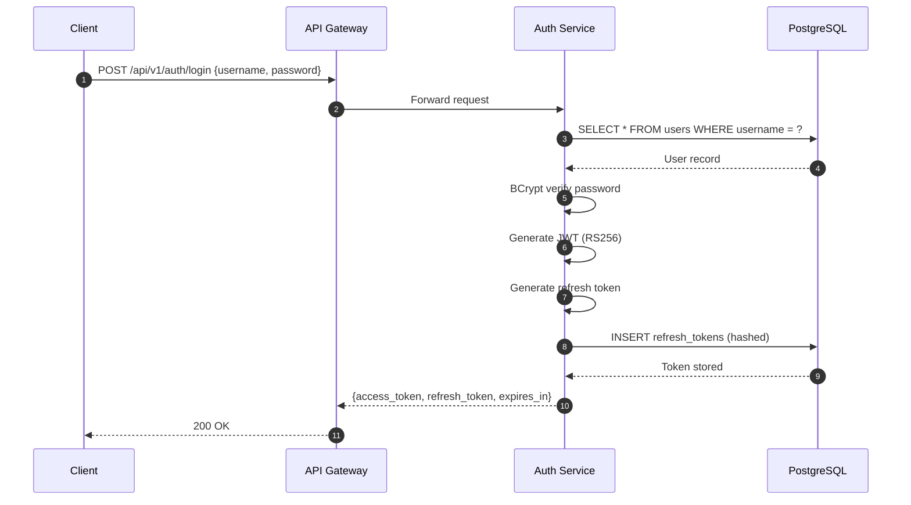
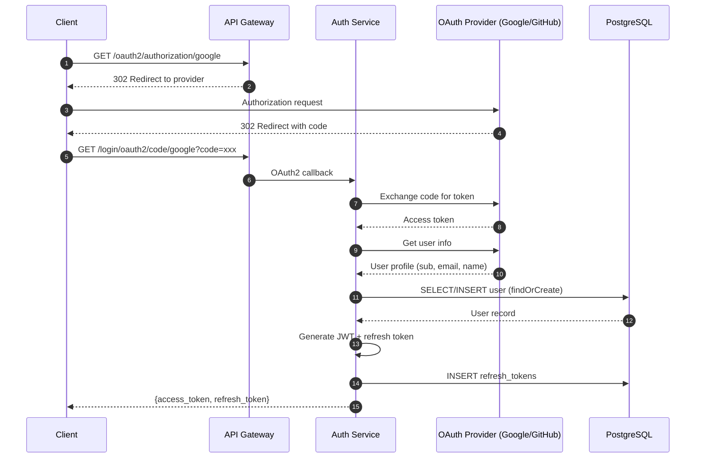
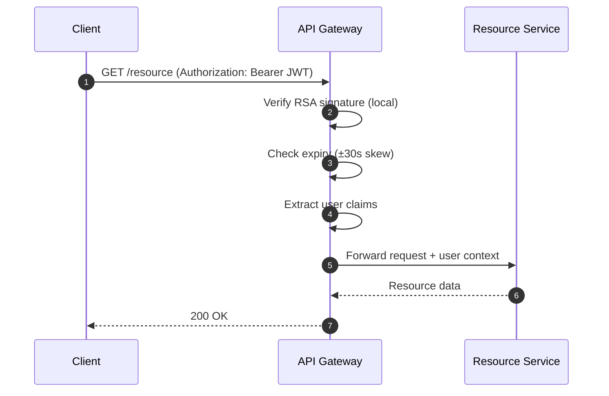

# Auth Service - Technical Solution Design

**Date:** 2026-03-02
**Status:** DRAFT
**Version:** 1.0
**Based on:** requirement-2026-03-02.md, tech-decisions-2026-03-02.md

---

## 1. System Architecture

### 1.1 Component Overview

```
┌─────────────────────────────────────────────────────────────────────────────┐
│                          SYSTEM ARCHITECTURE                                │
├─────────────────────────────────────────────────────────────────────────────┤
│                                                                             │
│  ┌──────────────┐         ┌──────────────┐         ┌──────────────┐        │
│  │              │         │              │         │              │        │
│  │   CLIENT     │◄────────┤  API GATEWAY │◄────────┤   RESOURCE   │        │
│  │              │         │              │         │   SERVICES   │        │
│  └──────────────┘         └──────┬───────┘         └──────────────┘        │
│                                   │                                         │
│                                   │ Local JWT Validation                   │
│                                   │ (No network call)                       │
│                                   │                                         │
│                          ┌────────▼────────┐                                │
│                          │                 │                                │
│                          │  AUTH SERVICE   │                                │
│                          │                 │                                │
│                          │  ┌───────────┐  │                                │
│                          │  │ Security  │  │                                │
│                          │  │  Config   │  │                                │
│                          │  └───────────┘  │                                │
│                          │  ┌───────────┐  │                                │
│                          │  │   OAuth2  │  │                                │
│                          │  │  Handler  │  │                                │
│                          │  └───────────┘  │                                │
│                          │  ┌───────────┐  │                                │
│                          │  │    JWT    │  │                                │
│                          │  │  Provider │  │                                │
│                          │  └───────────┘  │                                │
│                          └────────┬────────┘                                │
│                                   │                                         │
│                          ┌────────▼────────┐                                │
│                          │   PostgreSQL    │                                │
│                          │   Database      │                                │
│                          └─────────────────┘                                │
│                                                                             │
│  ┌──────────────┐         ┌──────────────┐                                 │
│  │   Google     │         │    GitHub    │                                 │
│  │   OAuth2     │         │    OAuth2    │                                 │
│  └──────────────┘         └──────────────┘                                 │
│                                                                             │
└─────────────────────────────────────────────────────────────────────────────┘
```

### 1.2 Authentication Flows

#### 1.2.1 Password Login Flow



#### 1.2.2 OAuth2 Login Flow



#### 1.2.3 Token Validation Flow (Local)



---

## 2. API Design

### 2.1 REST Endpoints

| Method | Path | Description | Auth Required |
|--------|------|-------------|---------------|
| POST | /api/v1/auth/login | Password login | No |
| POST | /api/v1/auth/refresh | Refresh access token | No |
| POST | /api/v1/auth/logout | Logout (revoke refresh token) | No |
| POST | /api/v1/auth/password-reset/request | Request password reset | No |
| POST | /api/v1/auth/password-reset/confirm | Confirm password reset | No |
| GET | /oauth2/authorization/{provider} | Initiate OAuth2 flow | No |
| GET | /login/oauth2/code/{provider} | OAuth2 callback | No |
| GET | /actuator/health | Health check | No |

### 2.2 Request/Response Schemas

#### 2.2.1 Login Request

```json
{
  "username": "string (3-255 chars)",
  "password": "string (8-255 chars)"
}
```

#### 2.2.2 Auth Response

```json
{
  "access_token": "string (JWT)",
  "refresh_token": "string",
  "token_type": "Bearer",
  "expires_in": 900
}
```

#### 2.2.3 Refresh Token Request

```json
{
  "refresh_token": "string"
}
```

#### 2.2.4 Error Response

```json
{
  "timestamp": "2024-03-02T10:00:00Z",
  "status": 401,
  "error": "Unauthorized",
  "message": "Invalid credentials",
  "path": "/api/v1/auth/login"
}
```

### 2.3 HTTP Status Codes

| Code | Usage |
|------|-------|
| 200 | Success (login, refresh, logout) |
| 302 | OAuth2 redirects |
| 400 | Invalid request format |
| 401 | Invalid credentials or token |
| 404 | User not found |
| 429 | Rate limit exceeded |
| 500 | Internal server error |

---

## 3. Database Schema

### 3.1 DDL (Data Definition Language)

```sql
-- Enable UUID extension
CREATE EXTENSION IF NOT EXISTS "uuid-ossp";

-- Users table
CREATE TABLE users (
    user_id UUID PRIMARY KEY DEFAULT uuid_generate_v4(),
    username VARCHAR(255) UNIQUE NOT NULL,
    email VARCHAR(255) UNIQUE NOT NULL,
    password_hash VARCHAR(255),
    auth_type VARCHAR(50) NOT NULL DEFAULT 'password',
    oauth_provider VARCHAR(50),
    oauth_subject_id VARCHAR(255),
    created_at TIMESTAMPTZ NOT NULL DEFAULT NOW(),
    updated_at TIMESTAMPTZ NOT NULL DEFAULT NOW(),
    deleted_at TIMESTAMPTZ
);

-- Indexes for users
CREATE INDEX idx_users_email ON users(email) WHERE deleted_at IS NULL;
CREATE INDEX idx_users_oauth ON users(oauth_provider, oauth_subject_id) WHERE deleted_at IS NULL;

-- Refresh tokens table
CREATE TABLE refresh_tokens (
    token_id UUID PRIMARY KEY DEFAULT uuid_generate_v4(),
    user_id UUID NOT NULL REFERENCES users(user_id) ON DELETE CASCADE,
    token_hash VARCHAR(64) NOT NULL,
    device_id VARCHAR(64),
    expires_at TIMESTAMPTZ NOT NULL,
    revoked BOOLEAN NOT NULL DEFAULT FALSE,
    created_at TIMESTAMPTZ NOT NULL DEFAULT NOW()
);

-- Indexes for refresh_tokens
CREATE INDEX idx_refresh_tokens_user ON refresh_tokens(user_id, revoked) WHERE revoked = FALSE;
CREATE INDEX idx_refresh_tokens_device ON refresh_tokens(device_id);
CREATE INDEX idx_refresh_tokens_expiry ON refresh_tokens(expires_at) WHERE revoked = FALSE;

-- Token blacklist table
CREATE TABLE token_blacklist (
    blacklist_id UUID PRIMARY KEY DEFAULT uuid_generate_v4(),
    jti VARCHAR(255) UNIQUE NOT NULL,
    user_id UUID NOT NULL REFERENCES users(user_id) ON DELETE CASCADE,
    revoked_at TIMESTAMPTZ NOT NULL DEFAULT NOW(),
    expires_at TIMESTAMPTZ NOT NULL
);

-- Indexes for token_blacklist
CREATE INDEX idx_blacklist_jti ON token_blacklist(jti);
CREATE INDEX idx_blacklist_expiry ON token_blacklist(expires_at);

-- Password reset tokens table
CREATE TABLE password_reset_tokens (
    token_id UUID PRIMARY KEY DEFAULT uuid_generate_v4(),
    token UUID UNIQUE NOT NULL DEFAULT uuid_generate_v4(),
    user_id UUID NOT NULL REFERENCES users(user_id) ON DELETE CASCADE,
    expires_at TIMESTAMPTZ NOT NULL,
    used BOOLEAN NOT NULL DEFAULT FALSE,
    created_at TIMESTAMPTZ NOT NULL DEFAULT NOW()
);

-- Indexes for password_reset_tokens
CREATE INDEX idx_password_reset_token ON password_reset_tokens(token);
CREATE INDEX idx_password_reset_user ON password_reset_tokens(user_id, used) WHERE used = FALSE;

-- Function to update updated_at timestamp
CREATE OR REPLACE FUNCTION update_updated_at_column()
RETURNS TRIGGER AS $$
BEGIN
    NEW.updated_at = NOW();
    RETURN NEW;
END;
$$ LANGUAGE plpgsql;

-- Trigger for users table
CREATE TRIGGER update_users_updated_at
    BEFORE UPDATE ON users
    FOR EACH ROW
    EXECUTE FUNCTION update_updated_at_column();

-- Cleanup job: Delete expired tokens (run via scheduled task)
CREATE OR REPLACE FUNCTION cleanup_expired_tokens()
RETURNS void AS $$
BEGIN
    DELETE FROM refresh_tokens WHERE expires_at < NOW();
    DELETE FROM token_blacklist WHERE expires_at < NOW();
    DELETE FROM password_reset_tokens WHERE expires_at < NOW();
END;
$$ LANGUAGE plpgsql;
```

### 3.2 Entity Relationships

```
┌─────────────┐
│    users    │
│ ─────────── │
│ user_id (PK)│
│ username    │
│ email       │
│ password    │
│ oauth_*     │
└──────┬──────┘
       │ 1
       │
       │ N
┌──────▼───────────┐        ┌─────────────────┐
│  refresh_tokens  │        │ token_blacklist │
│ ────────────────│        │ ─────────────── │
│ token_id (PK)   │        │ blacklist_id    │
│ user_id (FK)    │        │ jti             │
│ token_hash      │        │ user_id (FK)    │
│ expires_at      │        │ expires_at      │
└─────────────────┘        └─────────────────┘
       │
       │ N
┌──────▼─────────────┐
│password_reset_tokens│
│ ─────────────────── │
│ token_id (PK)       │
│ user_id (FK)        │
│ token               │
└─────────────────────┘
```

---

## 4. Security Design

### 4.1 JWT Token Structure

```json
{
  "header": {
    "alg": "RS256",
    "typ": "JWT",
    "kid": "key-2024-03-02"
  },
  "payload": {
    "jti": "550e8400-e29b-41d4-a716-446655440000",
    "sub": "user-uuid",
    "username": "john_doe",
    "email": "john@example.com",
    "auth_type": "password",
    "iat": 1709376000,
    "exp": 1709376900,
    "iss": "auth-service",
    "aud": "api-gateway"
  }
}
```

### 4.2 Refresh Token Format

```
┌─────────────────────────────────────────────────────────────┐
│                    REFRESH TOKEN FORMAT                     │
├─────────────────────────────────────────────────────────────┤
│                                                             │
│  Format:  64-character hex string (SHA-256 hash)           │
│  Storage: Hashed in database                               │
│  Expiry:  7 days (604800 seconds)                          │
│  Rotation: Every refresh                                    │
│                                                             │
│  Database:                                                  │
│  ┌──────────────┬─────────────┬─────────────┬─────────────┐│
│  │ token_id    │ user_id     │ token_hash  │ device_id   ││
│  ├──────────────┼─────────────┼─────────────┼─────────────┤│
│  │ UUID        │ UUID        │ SHA256      │ UA hash     ││
│  └──────────────┴─────────────┴─────────────┴─────────────┘│
│                                                             │
└─────────────────────────────────────────────────────────────┘
```

### 4.3 Rate Limiting Strategy

```
┌─────────────────────────────────────────────────────────────┐
│                    RATE LIMITING CONFIG                     │
├─────────────────────────────────────────────────────────────┤
│                                                             │
│  ┌───────────────────────────────────────────────────────┐ │
│  │  LOGIN ENDPOINT                                       │ │
│  │  Limit: 5 attempts per IP per minute                  │ │
│  │  Algorithm: Token Bucket (Bucket4j)                   │ │
│  │  Blocking: 429 Too Many Requests                      │ │
│  └───────────────────────────────────────────────────────┘ │
│                                                             │
│  ┌───────────────────────────────────────────────────────┐ │
│  │  REFRESH ENDPOINT                                     │ │
│  │  Limit: 10 attempts per user per minute               │ │
│  │  Algorithm: Token Bucket (Bucket4j)                   │ │
│  │  Blocking: 429 Too Many Requests                      │ │
│  └───────────────────────────────────────────────────────┘ │
│                                                             │
│  ┌───────────────────────────────────────────────────────┐ │
│  │  IMPLEMENTATION                                        │ │
│  │  - Caffeine cache for bucket storage                  │ │
│  │  - Filter-based: RateLimitFilter                      │ │
│  │  - IP-based for login                                 │ │
│  │  - User-based for refresh                             │ │
│  └───────────────────────────────────────────────────────┘ │
│                                                             │
└─────────────────────────────────────────────────────────────┘
```

---

## 5. Component Design

### 5.1 Security Filter Chain

```
┌─────────────────────────────────────────────────────────────┐
│              SPRING SECURITY FILTER CHAIN                   │
├─────────────────────────────────────────────────────────────┤
│                                                             │
│  Request ──▶ RateLimitFilter ──▶ OAuth2 Filter             │
│                    │               │                        │
│                    ▼               ▼                        │
│              ┌─────────────────────────┐                   │
│              │   Exception Translation │                   │
│              └─────────────────────────┘                   │
│                         │                                  │
│                         ▼                                  │
│              ┌─────────────────────────┐                   │
│              │   Filter Security       │                   │
│              │   interceptor           │                   │
│              └─────────────────────────┘                   │
│                         │                                  │
│                         ▼                                  │
│              ┌─────────────────────────┐                   │
│              │   UsernamePassword      │                   │
│              │   AuthenticationFilter  │                   │
│              └─────────────────────────┘                   │
│                         │                                  │
│                         ▼                                  │
│              ┌─────────────────────────┐                   │
│              │   SecurityContext       │                   │
│              │   PersistenceFilter     │                   │
│              └─────────────────────────┘                   │
│                         │                                  │
│                         ▼                                  │
│                    Controller                              │
│                                                             │
└─────────────────────────────────────────────────────────────┘
```

### 5.2 Service Layer Responsibilities

```
┌─────────────────────────────────────────────────────────────┐
│                    SERVICE LAYER                            │
├─────────────────────────────────────────────────────────────┤
│                                                             │
│  ┌─────────────────┐  ┌─────────────────┐                 │
│  │  AuthService    │  │  TokenService   │                 │
│  │  ─────────────  │  │  ─────────────  │                 │
│  │  - login()      │  │  - generate()   │                 │
│  │  - logout()     │  │  - validate()   │                 │
│  │  - validate()   │  │  - refresh()    │                 │
│  └─────────────────┘  └─────────────────┘                 │
│           │                     │                           │
│           └──────────┬──────────┘                           │
│                      ▼                                      │
│         ┌─────────────────────────┐                        │
│         │     UserService         │                        │
│         │  ─────────────────────  │                        │
│         │  - findOrCreate()       │                        │
│         │  - updatePassword()     │                        │
│         │  - softDelete()         │                        │
│         └─────────────────────────┘                        │
│                      │                                      │
│                      ▼                                      │
│         ┌─────────────────────────┐                        │
│         │   UserRepository        │                        │
│         │   RefreshTokenRepository│                        │
│         │   TokenBlacklistRepo    │                        │
│         └─────────────────────────┘                        │
│                                                             │
└─────────────────────────────────────────────────────────────┘
```

### 5.3 Exception Handling

```
┌─────────────────────────────────────────────────────────────┐
│              EXCEPTION HANDLING STRATEGY                    │
├─────────────────────────────────────────────────────────────┤
│                                                             │
│  Exception              │ HTTP Status │ Response           │
│  ───────────────────────┼─────────────┼────────────────────│
│  InvalidCredentials     │ 401         │ Invalid credentials │
│  TokenExpiredException  │ 401         │ Token expired       │
│  RateLimitExceeded      │ 429         │ Rate limit exceeded  │
│  UserNotFoundException  │ 404         │ User not found      │
│  AuthException          │ 500         │ Internal error      │
│                                                             │
│  Handler: @GlobalExceptionHandler                           │
│  Format:  RFC 7807 Problem Details (optional)              │
│                                                             │
└─────────────────────────────────────────────────────────────┘
```

---

## 6. Configuration Management

### 6.1 Application Configuration Structure

```yaml
# application.yml (base config)
spring:
  application:
    name: auth-service
  profiles:
    active: ${ENV:dev}

---
# application-dev.yml
spring:
  datasource:
    url: jdbc:postgresql://localhost:5432/authdb_dev
  jpa:
    show-sql: true
logging:
  level:
    com.vibe.auth: DEBUG

---
# application-prod.yml
spring:
  datasource:
    url: jdbc:postgresql://${DB_HOST}:${DB_PORT}/${DB_NAME}
  jpa:
    show-sql: false
logging:
  level:
    com.vibe.auth: INFO
```

### 6.2 Environment Variables

```
┌─────────────────────────────────────────────────────────────┐
│              ENVIRONMENT VARIABLES                          │
├─────────────────────────────────────────────────────────────┤
│                                                             │
│  Database:                                                  │
│    DB_PASSWORD                                             │
│    DB_HOST                                                 │
│    DB_PORT                                                 │
│    DB_NAME                                                 │
│                                                             │
│  OAuth2:                                                    │
│    GOOGLE_CLIENT_ID                                        │
│    GOOGLE_CLIENT_SECRET                                    │
│    GITHUB_CLIENT_ID                                        │
│    GITHUB_CLIENT_SECRET                                    │
│                                                             │
│  JWT:                                                       │
│    JWT_SECRET (not used with RS256)                        │
│    JWT_KEY_PATH                                            │
│                                                             │
└─────────────────────────────────────────────────────────────┘
```

### 6.3 Secret Management (Local)

```
/opt/auth-service/
├── keys/
│   ├── private.key  (600 permissions)
│   └── public.key   (644 permissions)
└── config/
    └── application-prod.yml
```

---

## 7. Monitoring & Observability

### 7.1 Actuator Endpoints

```
┌─────────────────────────────────────────────────────────────┐
│              ACTUATOR ENDPOINTS                             │
├─────────────────────────────────────────────────────────────┤
│                                                             │
│  GET /actuator/health       ──▶ Service health             │
│  GET /actuator/metrics      ──▶ JVM metrics                │
│  GET /actuator/prometheus   ──▶ Prometheus format          │
│  GET /actuator/info         ──▶ Build info                 │
│                                                             │
│  Health Indicators:                                          │
│    - Database (PostgreSQL)                                  │
│    - Disk Space                                             │
│    - Key Store                                              │
│                                                             │
└─────────────────────────────────────────────────────────────┘
```

### 7.2 Metrics to Track

| Metric | Type | Description |
|--------|------|-------------|
| auth.login.attempts | Counter | Total login attempts |
| auth.login.success | Counter | Successful logins |
| auth.login.failure | Counter | Failed logins |
| auth.token.refresh | Counter | Token refreshes |
| auth.oauth2.logins | Counter | OAuth2 logins by provider |
| auth.rate_limit.rejected | Counter | Rate limit rejections |
| auth.jwt.validation.time | Timer | JWT validation latency |
| auth.db.query.time | Timer | Database query latency |

### 7.3 Logging Strategy

```
┌─────────────────────────────────────────────────────────────┐
│              LOGGING LEVELS                                 │
├─────────────────────────────────────────────────────────────┤
│                                                             │
│  ERROR:   Authentication failures, system errors           │
│  WARN:    Rate limit violations, suspicious activity       │
│  INFO:    Successful logins, token refreshes               │
│  DEBUG:   Request/response details (dev only)              │
│                                                             │
│  Format: JSON structured logging                            │
│  Output: stdout (for container log aggregation)            │
│                                                             │
│  Sensitive Data (REDACTED):                                  │
│    - Passwords (never logged)                               │
│    - Token values (log only first 10 chars)                │
│    - PII (email, phone)                                     │
│                                                             │
└─────────────────────────────────────────────────────────────┘
```

---

## 8. Deployment Architecture

### 8.1 Local Deployment Setup

```
┌─────────────────────────────────────────────────────────────┐
│              LOCAL DEPLOYMENT                               │
├─────────────────────────────────────────────────────────────┤
│                                                             │
│  ┌─────────────────────────────────────────────────────┐   │
│  │              Docker Compose                          │   │
│  │  ┌──────────────────────────────────────────────┐   │   │
│  │  │  auth-service (Spring Boot)                   │   │   │
│  │  │  - Port: 8080                                │   │   │
│  │  │  - Java: 21                                  │   │   │
│  │  │  - JVM: -Xmx512m                             │   │   │
│  │  └──────────────────────────────────────────────┘   │   │
│  │                      │                               │   │
│  │                      ▼                               │   │
│  │  ┌──────────────────────────────────────────────┐   │   │
│  │  │  PostgreSQL 15                               │   │   │
│  │  │  - Port: 5432                               │   │   │
│  │  │  - Database: authdb                         │   │   │
│  │  │  - User: authuser                           │   │   │
│  │  │  - Volume: ./pgdata                         │   │   │
│  │  └──────────────────────────────────────────────┘   │   │
│  └─────────────────────────────────────────────────────┘   │
│                                                             │
└─────────────────────────────────────────────────────────────┘
```

### 8.2 Docker Configuration

```dockerfile
# Dockerfile
FROM eclipse-temurin:21-jre-alpine

WORKDIR /app
COPY target/auth-service-*.jar app.jar

# Create key storage directory
RUN mkdir -p /opt/auth-service/keys

# Generate keys on startup (or mount from volume)
RUN chmod 700 /opt/auth-service/keys

EXPOSE 8080

ENTRYPOINT ["java", \
    "-XX:+UseContainerSupport", \
    "-XX:MaxRAMPercentage=75", \
    "-jar", \
    "/app.jar"]
```

```yaml
# docker-compose.yml
version: '3.8'

services:
  auth-service:
    build: .
    ports:
      - "8080:8080"
    environment:
      - SPRING_PROFILES_ACTIVE=dev
      - DB_PASSWORD=postgres
      - GOOGLE_CLIENT_ID=${GOOGLE_CLIENT_ID}
      - GOOGLE_CLIENT_SECRET=${GOOGLE_CLIENT_SECRET}
    depends_on:
      - postgres
    volumes:
      - ./keys:/opt/auth-service/keys

  postgres:
    image: postgres:15-alpine
    environment:
      - POSTGRES_DB=authdb
      - POSTGRES_USER=authuser
      - POSTGRES_PASSWORD=postgres
    volumes:
      - ./pgdata:/var/lib/postgresql/data
    ports:
      - "5432:5432"
```

---

## 9. Implementation Phases

### 9.1 Phase 1: Core Authentication (Weeks 1-2)

```
┌─────────────────────────────────────────────────────────────┐
│  PHASE 1: CORE AUTHENTICATION                              │
├─────────────────────────────────────────────────────────────┤
│                                                             │
│  Week 1:                                                    │
│    [ ] Project setup (Spring Boot 3.2, Java 21, Maven)     │
│    [ ] Database schema creation                            │
│    [ ] User, RefreshToken entities                         │
│    [ ] UserRepository, RefreshTokenRepository              │
│    [ ] SecurityConfig (filter chain)                       │
│                                                             │
│  Week 2:                                                    │
│    [ ] JwtTokenProvider (RS256)                            │
│    [ ] AuthService (login, validate)                       │
│    [ ] TokenService (generate, refresh)                    │
│    [ ] AuthController (endpoints)                          │
│    [ ] Unit tests + integration tests                      │
│                                                             │
└─────────────────────────────────────────────────────────────┘
```

### 9.2 Phase 2: OAuth2 Integration (Weeks 3-4)

```
┌─────────────────────────────────────────────────────────────┐
│  PHASE 2: OAUTH2 INTEGRATION                               │
├─────────────────────────────────────────────────────────────┤
│                                                             │
│  Week 3:                                                    │
│    [ ] OAuth2Config (Google, GitHub)                       │
│    [ ] OAuth2AuthenticationSuccessHandler                  │
│    [ ] UserService (findOrCreate OAuth user)               │
│    [ ] OAuth2 flow integration testing                     │
│                                                             │
│  Week 4:                                                    │
│    [ ] RateLimitFilter (Bucket4j)                          │
│    [ ] RateLimitConfig                                     │
│    [ ] GlobalExceptionHandler                              │
│    [ ] OpenAPI documentation                               │
│    [ ] End-to-end testing                                 │
│                                                             │
└─────────────────────────────────────────────────────────────┘
```

### 9.3 Phase 3: Advanced Features (Weeks 5-6)

```
┌─────────────────────────────────────────────────────────────┐
│  PHASE 3: ADVANCED FEATURES                                │
├─────────────────────────────────────────────────────────────┤
│                                                             │
│  Week 5:                                                    │
│    [ ] Password reset flow                                 │
│    [ ] TokenBlacklist functionality                        │
│    [ ] Scheduled cleanup jobs                              │
│    [ ] Actuator configuration                              │
│                                                             │
│  Week 6:                                                    │
│    [ ] Key rotation service                                │
│    [ ] Metrics and monitoring                              │
│    [ ] Performance testing                                 │
│    [ ] Security audit                                      │
│                                                             │
└─────────────────────────────────────────────────────────────┘
```

### 9.4 Phase 4: Deployment & MVP (Weeks 7-8)

```
┌─────────────────────────────────────────────────────────────┐
│  PHASE 4: DEPLOYMENT & MVP                                 │
├─────────────────────────────────────────────────────────────┤
│                                                             │
│  Week 7:                                                    │
│    [ ] Dockerfile                                          │
│    [ ] docker-compose.yml                                  │
│    [ ] Database migration scripts                          │
│    [ ] Environment configuration                           │
│                                                             │
│  Week 8:                                                    │
│    [ ] Deployment testing                                  │
│    [ ] Load testing                                        │
│    [ ] Documentation finalization                          │
│    [ ] MVP release                                         │
│                                                             │
└─────────────────────────────────────────────────────────────┘
```

---

## 10. Risk Mitigation

| Risk | Impact | Mitigation |
|------|--------|------------|
| Database connection exhaustion | High | HikariCP config, connection pool monitoring |
| JWT secret compromise | Critical | RSA key pair, rotation every 90 days |
| OAuth2 provider outage | Medium | Multiple providers, fallback to password |
| Replay attacks | High | Refresh token rotation, device fingerprinting |
| Clock skew | Medium | ±30 second tolerance, NTP sync |
| Rate limiting bypass | Medium | IP-based + user-based limiting |

---

**Document Status:** DRAFT - Ready for review
**Next Step:** Step 2.4 - Design Review (solution-critic)
